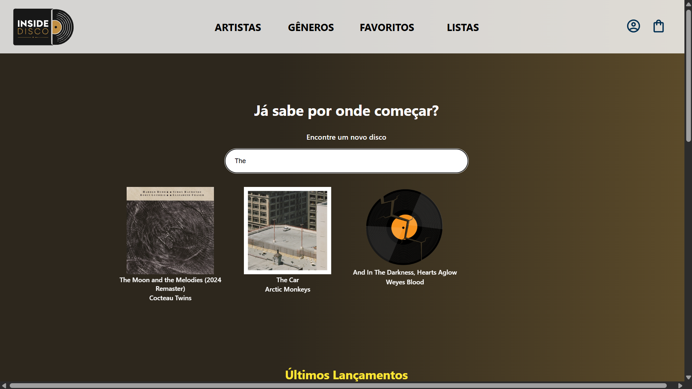
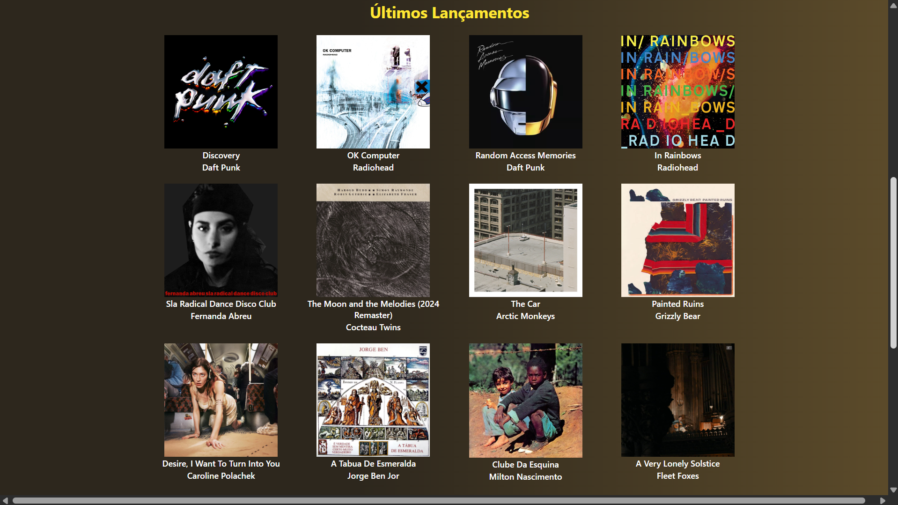
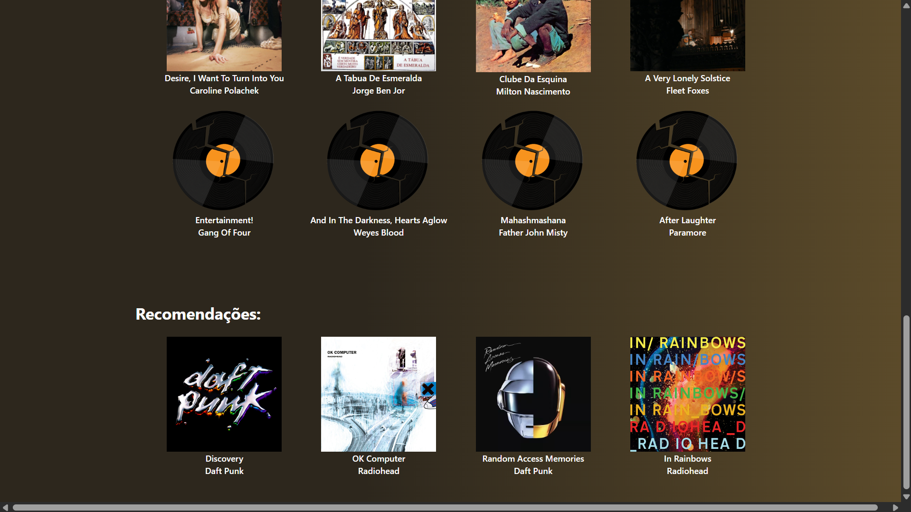
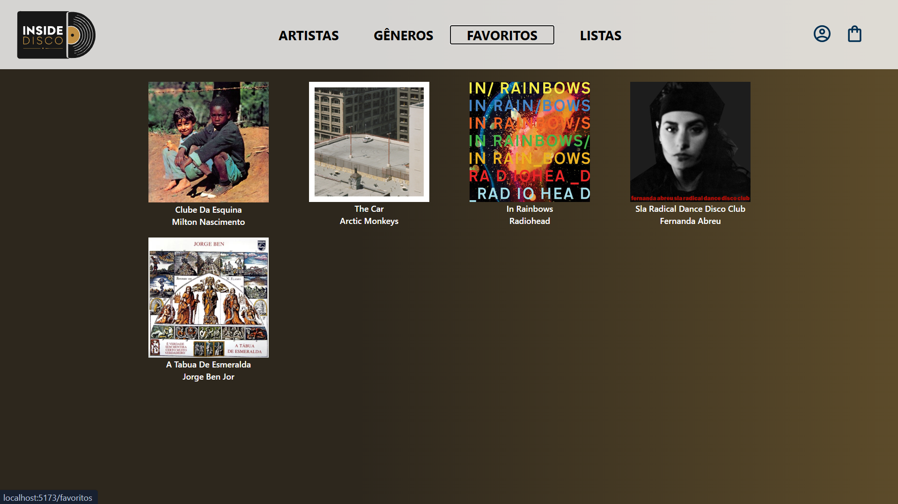

# 💽 Inside Disco

Uma aplicação full stack para descobrir, avaliar e organizar discos/álbuns musicais. Conceito inspirado na ideia de um "Letterboxd para música", o Inside Disco permite explorar lançamentos e montar sua coleção de favoritos.

> ⚠️ **Projeto em desenvolvimento.** As funcionalidades atuais formam a base de uma plataforma maior (ver [Roadmap](#-roadmap)).

---

## 📸 Preview







---

## ✨ Funcionalidades atuais

- **Listagem de discos** — exibe os discos disponíveis, consumidos a partir da API.
- **Busca** — encontre discos pelo nome através da barra de pesquisa.
- **Favoritos** — adicione discos aos favoritos (na página inicial) e remova-os (na página de favoritos).
- **Recomendações** — uma seção que sugere discos com base em um filtro.

---

## 🛠️ Tecnologias

**Frontend**
- React
- Vite
- styled-components
- React Router DOM
- Axios

**Backend**
- Node.js
- Express
- CORS

**Persistência de dados**
- Atualmente os dados são mockados em arquivos JSON, lidos e escritos pelo backend.
- O projeto está estruturado para migrar para um banco de dados real em breve.

---

## 📁 Estrutura do projeto

O projeto é organizado como um **monorepo**, com frontend e backend no mesmo repositório:

```
inside-disco/
├── frontend/          # Aplicação React (Vite)
│   └── src/
│       ├── components/   # Componentes com lógica
│       ├── ui/           # Componentes visuais reutilizáveis
│       ├── routes/       # Páginas da aplicação
│       ├── services/     # Comunicação com a API (axios)
│       └── hooks/        # Hooks customizados
│
└── backend/           # API REST (Node + Express)
    ├── controllers/      # Recebem requisições e devolvem respostas
    ├── routes/           # Definição dos endpoints
    ├── services/         # Lógica de negócio e acesso aos dados
    └── data/             # Arquivos JSON (mock do "banco de dados")
```

A comunicação com a API é isolada em uma **camada de serviços**, mantendo os componentes focados apenas na interface.

---

## 🚀 Como rodar o projeto

### Pré-requisitos
- [Node.js](https://nodejs.org/) (versão 18 ou superior)
- npm

### Passo a passo

1. **Clone o repositório**
   ```bash
   git clone https://github.com/Kelven-Colombo/inside-disco.git
   cd inside-disco
   ```

2. **Instale as dependências** (frontend e backend)
   ```bash
   cd frontend && npm install
   cd ../backend && npm install
   ```

3. **Rode o backend** (na pasta `backend/`)
   ```bash
   npm run dev
   ```
   O servidor sobe na porta `8000`.

4. **Rode o frontend** (na pasta `frontend/`, em outro terminal)
   ```bash
   npm run dev
   ```
   A aplicação abre em `http://localhost:5173`.

> 💡 Há também um script na raiz que sobe os dois ao mesmo tempo com `npm run dev` (via `concurrently`).

---

## 🗺️ Roadmap

O Inside Disco está sendo construído para se tornar uma plataforma completa de catalogação musical. Próximos passos planejados:

- [ ] Página de detalhes de cada disco (informações, capa, link para streaming)
- [ ] Sistema de avaliação (review com nota de 0 a 5 estrelas)
- [ ] Espaço para comentários nos discos
- [ ] Listas personalizadas criadas pelo usuário (sendo "Favoritos" uma lista fixa)
- [ ] Páginas de Artistas e Gêneros
- [ ] Autenticação de usuários
- [ ] Migração do mock JSON para um banco de dados real
- [ ] Integração com API de música (capas e metadados oficiais)

---

## 👤 Autor

**Kelven Colombo**
- GitHub: [@Kelven-Colombo](https://github.com/Kelven-Colombo)